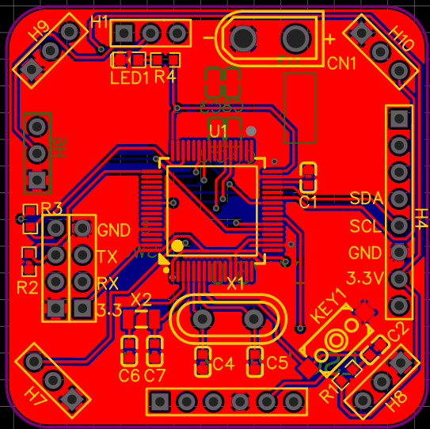

# Qingluan 四轴无人机项目，代号青鸾

> 第一版固件已经推送到仓库（2023.2.11）

本项目为软硬件自主设计的四轴无人机项目，代号青鸾

## 仓库目录结构(待更新)

```txt
/Doc			文档目录
/hardware 		硬件目录
/software		软件目录
README.md 		概述文件
```
## 硬件端口定义

### GY-86
| 芯片引脚 | 传感器端口定义 |
| -------- | -------------- |
| PB3      | I2C2_SDA       |
| PB10     | I2C2_SCL       |

### 蓝牙

| 芯片引脚 | 传感器端口定义 |
| -------- | -------------- |
| PC_6     | UART6_TX       |
| PC_7     | UART6_RX       |

### 电机

| 芯片引脚 | 传感器端口定义 |
| -------- | -------------- |
| PA_6     | CH1            |
| PA_7     | CH2            |
| PB_0     | CH3            |
| PB_1     | CH4            |

### 接收机

| 芯片引脚 | 传感器端口定义 |
| -------- | -------------- |
| PA_5     | PPM            |

### 调试串口

| 芯片引脚 | 传感器端口定义 |
| -------- | -------------- |
| PA_9     | UART1_TX       |
| PA_10    | UART1_RX       |

### ST-link

| 芯片引脚 | 传感器端口定义 |
| -------- | -------------- |
| PA_13    | SWDIO          |
| PA_14    | SWCLK          |
